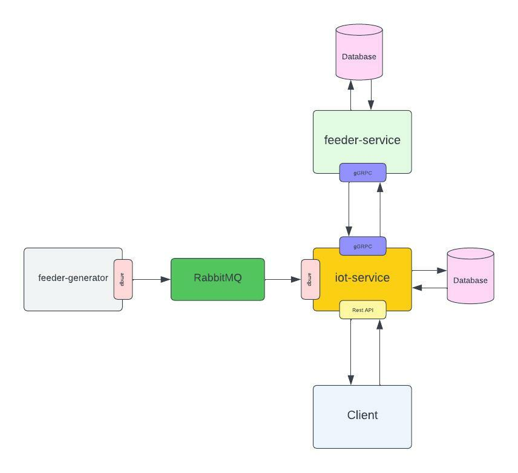

# Golang REST Example

### Architecture


### Tech Stack
- Echo v4
- gGRPC
- RabbitMQ
- mySQL

### Quick Installation 
1. Run service Messaging and Database
    ```sh
    $ docker-compose -f docker-compose-dev.yml up -d
    ```

### Manual Installation 
1. Run service Messaging and Database
    ```sh
    $ docker-compose up -d
    ```

2. Restore backup database ```feeder-service.sql``` to mySQL feeder-service
    ```sh
    $ mysql -h 127.0.0.1 -P 3307 -u root –p feeder-service < feeder-service.sql
    ```
3. Run ```feeder-generator```
    ```sh
    $ cd feeder-generator
    $ make run
    ```
    - health check

        ```sh
        $ curl http://llocalhost:3000/health-check 
        ok!%
        ```

4. Run ```feeder-service```
    ```sh
    $ cd feeder-service
    $ make run
    ```
    - health check

        ```sh
        $ curl http://localhost:9000/health-check
        ok!%
        ```

5. Run ```iot-service```
    ```sh
    $ cd iot-service
    $ make run
    ```
    - health check

        ```sh
        $ curl http://localhost:8000/health-check
        ok!%
        ```

### Test Service 
1. Run 3 endpoint API for send feedlogs
    - http://llocalhost:3000/send-feeder/00001-AL03005090R-SMIT
    - http://llocalhost:3000/send-feeder/00001-AL03005090R-SMIT
    - http://llocalhost:3000/send-feeder/00001-AL03005090R-SMIT

2. Run endpoint API http://localhost:8000/feedlogs-summary/{pond_uuid}/{data}
    - Example
        ```sh
        $ curl --request GET --url http://localhost:8000/feedlogs-summary/26f1b9ee-65d9-4c7d-afb1-f7137fefa784/2022-09-27 | json_pp 
        % Total    % Received % Xferd  Average Speed   Time    Time     Time  Current
                                        Dload  Upload   Total   Spent    Left  Speed
        100   804  100   804    0     0   9529      0 --:--:-- --:--:-- --:--:-- 13180
        {
            "data" : {
                "feedlogs" : {
                    "2022-09-27" : {
                        "details" : [
                        {
                            "feeder_barcode" : "00001-AL03005090R-SMIT",
                            "feeder_uuid" : "968ec500-c7f1-4527-a416-fb50bf567674",
                            "history" : [
                                {
                                    "output_gr" : 20,
                                    "timestamp" : 1663320240
                                },
                                {
                                    "output_gr" : 20,
                                    "timestamp" : 1663320250
                                },
                                {
                                    "output_gr" : 20,
                                    "timestamp" : 1663320260
                                },
                                {
                                    "output_gr" : 20,
                                    "timestamp" : 1663320270
                                },
                                {
                                    "output_gr" : 20,
                                    "timestamp" : 1663320280
                                }
                            ]
                        },
                        {
                            "feeder_barcode" : "00002-AL03005090R-F3ot",
                            "feeder_uuid" : "f179b6bc-1efd-428b-b692-8758ca8c21c9",
                            "history" : [
                                {
                                    "output_gr" : 20,
                                    "timestamp" : 1663320240
                                },
                                {
                                    "output_gr" : 20,
                                    "timestamp" : 1663320250
                                },
                                {
                                    "output_gr" : 20,
                                    "timestamp" : 1663320260
                                },
                                {
                                    "output_gr" : 20,
                                    "timestamp" : 1663320270
                                },
                                {
                                    "output_gr" : 20,
                                    "timestamp" : 1663320280
                                }
                            ]
                        }
                        ],
                        "total_output_gr" : 200
                    }
                },
                "pond_name" : "Kolam Gurame",
                "pond_uuid" : "26f1b9ee-65d9-4c7d-afb1-f7137fefa784"
            },
            "message" : "success",
            "success" : true
        }
        ```


### Contact
https://www.linkedin.com/in/aji-indra-jaya

License
----

MIT